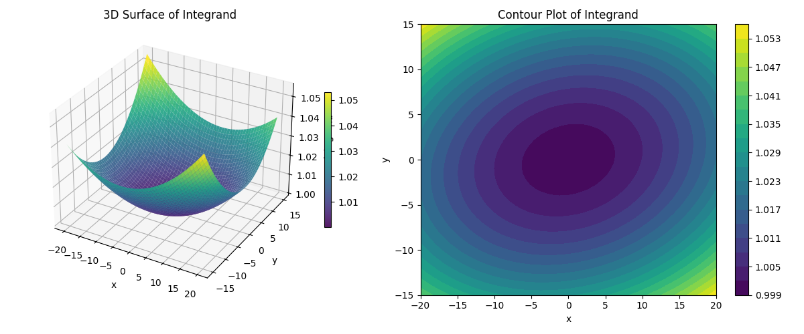
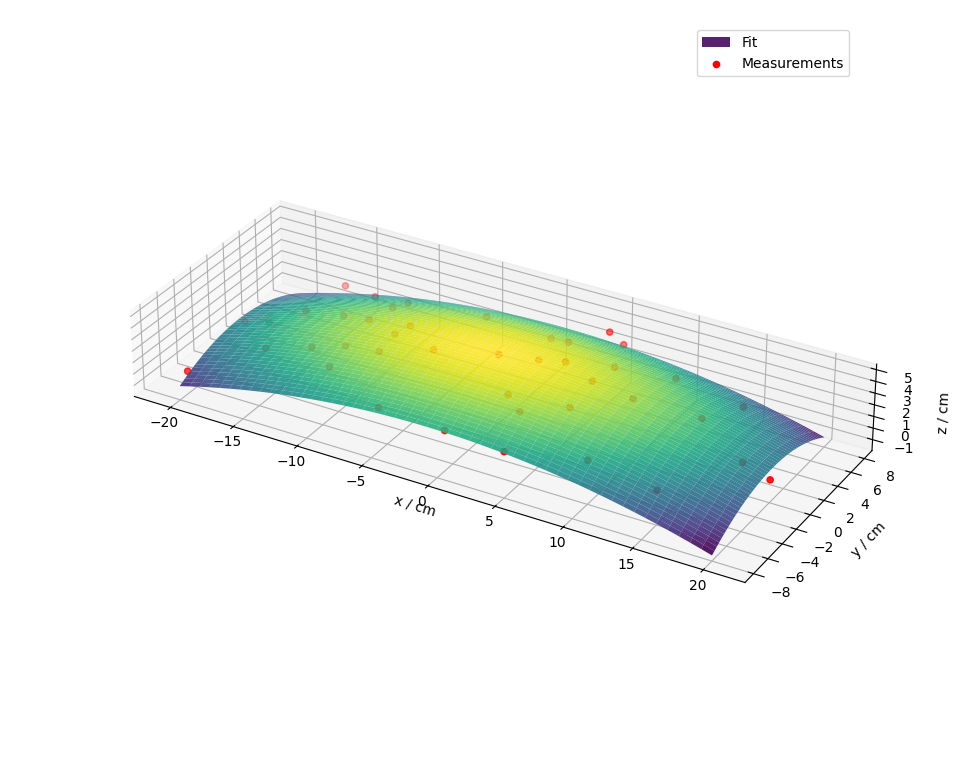

# Maths IA AA support
**tl;dr** - DeepSeek did your numerical integration correctly, but I'm not sure I agree with your fit function $z = f_\text{seat}(x, y)$

**How to run the code**: See [running-code.md](running-code.md)

## Checking surface area calculation using numerical integration

Visualisation of the surface integral calculation showing $z = f_\text{seat}(x, y)$ over the rectangular domain $x \in [-20, 20]$, $y \in [-15, 15]$

I wrote a Python program that calculates the surface area via numerical integration. The program is called `numeric-integrator.py`. I'm happy to explain how it works in our next lesson (or you can ask an LLM like DeepSeek -- it should be able to understand the code if you copy & paste it in). Importantly, the program uses the partial derivatives that you determined and gets the same result that you did.
```text
Computing the integral:
A = ∫∫ sqrt(1 + (-0.01x + 0.001y)² + (-0.016y + 0.001x)²) dx dy
Over region: [-20, 20] × [-15, 15]
------------------------------------------------------------

Method 1: Trapezoidal Rule
  Grid 201×151: A = 1219.421506
  Grid 401×301: A = 1219.420467
  Difference: 0.001039
  Relative difference: 0.000085%

Method 2: Vectorised Trapezoidal
  Grid 401×301: A = 1219.420467

Method 3: SciPy's dblquad (adaptive quadrature)
  (This may take a moment...)
  A = 1219.420121 ± 1.35e-11

============================================================
SUMMARY:
  The integral A ≈ 1219.42
  Rectangle area (40 × 30) = 1200
  Ratio A/Rectangle = 1.0162

Visualization plotted successfully!
```

## Checking 2D fit function $z = f(x, y)$
After verifying the numeric integration, I wanted to check that your fitting function was correct. I used the same bivarate quadratic as you,
$$
z = f(x, y) = a_0 + a_1 x + a_2 y + a_3 x^2 + a_4 xy + a_5 y^2,
$$
and used your data from Table 3 (see `data.csv`). The program that performs the fit is `2d-fit.py`. It outputs the following:
```text
a0 = np.float64(4.215787846074166) ± 0.20009587840901644
a1 = np.float64(-0.006303068904294884) ± 0.010103202985752078
a2 = np.float64(-0.006598820054735555) ± 0.024751842067191183
a3 = np.float64(-0.008132244200974137) ± 0.0009551852664410974
a4 = np.float64(0.0015092130706703122) ± 0.0025446134743452044
a5 = np.float64(-0.03323462922651155) ± 0.005517821131656234
------------------------------------------------------------

Fit function is therefore:
 z = f(x, y) = 4.215788 + -0.006303x + -0.006599y + -0.008132x^2 + 0.001509xy + -0.033235y^2
```


A bivariate quadratic fit to the data from Table 3 (see `data.csv`). The dots show your measurements.

This does not match your fit function,
$$z = f_\text{seat}(x, y) = -0.005x^2 - 0.008y^2 + 0.001xy + 0.5,$$
which means that the above numerical integration (which uses the partial derivatives $\partial z / \partial x$ and $\partial z / \partial y$) **may be wrong**. It's a simple fix -- we just need to change the fit function in `numeric-integrator.py` -- but we should probably discuss this first.
